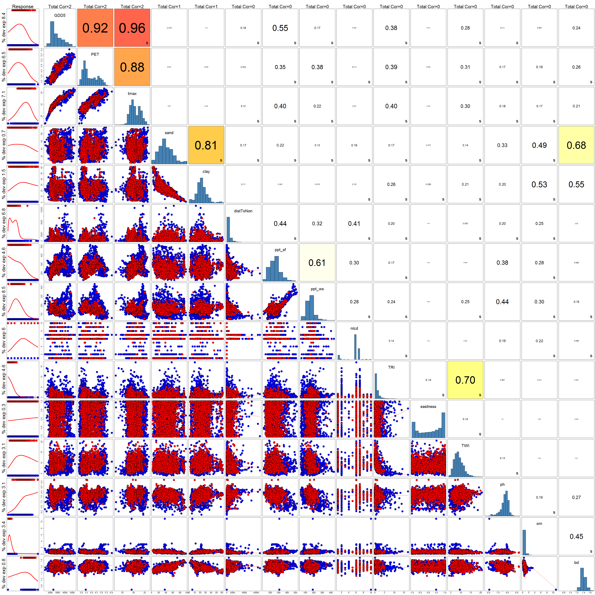

```{r setup, include=FALSE}
library(knitr)
library(kableExtra)
knitr::opts_chunk$set(cache = TRUE, cache.lazy = FALSE)
```

Expand code block to see libraries and functions used.
```{r message=FALSE, warning=FALSE, cache=FALSE}
library(dplyr)
library(stringr)
library(randomForest)
library(lme4)
library(ROCR)
library(PresenceAbsence) # for Kappa and PCC
#library(dismo) # for response curves, but doesn't work for either glmer or rf
library(ggplot2)

getConfusionMatrix <- function(tbl) {
  #https://stats.stackexchange.com/questions/35609/why-do-i-need-bag-composition-to-calculate-oob-error-of-combined-random-forest-m/35613#35613
  class.error = vector()
  
  for (i in 1:nrow(tbl)) {
    rowSum = sum(tbl[i,])
    accurate = diag(tbl)[i]
    error = rowSum - accurate
    
    class.error[i] = error / rowSum
  }   
  return(cbind(tbl, class.error))
}

opt.cut <- function(perf, pred){
  #https://www.r-bloggers.com/a-small-introduction-to-the-rocr-package/
  #calculates sensitivity = specificity threshold
  mapply(FUN=function(x, y, p){
    d = (x - 0)^2 + (y-1)^2
    ind = which(d == min(d))
    c(sensitivity = y[[ind]], specificity = 1-x[[ind]], 
      cutoff = p[[ind]])
  }, perf@x.values, perf@y.values, pred@cutoffs)
}

modEval <- function(modobj, run_name, modtype='GLM'){
  if(modtype=="RF"){
    p_rf.mod <- predict(modobj, type = "prob")
    pred.mod <- prediction(p_rf.mod[,2], modobj$y)
  } else {
    pred.mod <- prediction(modobj@resp$mu, modobj@resp$y)
  }
  
  perf.roc <- performance(pred.mod, "tpr", "fpr")
  perf.err <- performance(pred.mod, "err")
  AUC <- performance(pred.mod, measure = "auc")@y.values[[1]]
  sst <- opt.cut(perf.roc,pred.mod)
  TSS <- sst[1] + sst[2] - 1
  
  if(modtype=="RF"){
    ptab_rf.mod <- table(modobj$predicted, modobj$y)
    err_rate <- 1-sum(diag(ptab_rf.mod))/sum(ptab_rf.mod)
  } else {
    err_rate <- perf.err@y.values[[1]][which(perf.err@x.values[[1]] == sst[3])]
  }
  
  #Presence.Absence insists on its own data structure
  padat <- data.frame(ID=seq(1:length(pred.mod@predictions[[1]])),
                    OBS=as.numeric(levels(pred.mod@labels[[1]]))[pred.mod@labels[[1]]],
                    PRED=pred.mod@predictions[[1]])

  pacmx <- cmx(padat, threshold = sst[3])
  kappa <- Kappa(pacmx, st.dev = FALSE)
  PCC <- pcc(pacmx, st.dev = FALSE)
  
  #plotting ROC
  #ggplot code adapted from https://davidrroberts.wordpress.com/2015/09/22/quick-auc-function-in-r-with-rocr-package/
  i <- which(perf.roc@alpha.values[[1]] == sst[3])
  plotdat <- data.frame(FP=perf.roc@x.values[[1]],TP=perf.roc@y.values[[1]])
  rocp <- ggplot(plotdat, aes(x=FP,y=TP)) +
    geom_line(lwd=2, col="red") +
    geom_abline(intercept=0,slope=1,lwd=1,lty=2,col="gray") +
    geom_point(aes(x=perf.roc@x.values[[1]][i], y=perf.roc@y.values[[1]][i]), 
               pch=19, size=3, col="blue") +
    annotate("text",x=0.97,y=0.15,label=str_glue("AUC={round(AUC,3)}"),hjust=1) +
    annotate("text",x=0.97,y=0.10,label=str_glue("Threshold={round(sst[3],3)}"),hjust=1) +
    scale_x_continuous("False Positive Rate", limits=c(0,1)) +
    scale_y_continuous("True Positive Rate", limits=c(0,1)) +
    coord_fixed(ratio = 1) +
    ggtitle(paste(run_name, "ROC"))

  return(list(rocp, c(run_name, AUC, TSS, err_rate, kappa, PCC, sst[1], sst[2], sst[3]), pacmx))
}
```


# Results of the different runs {.tabset .tabset-fade}

Note that most of these models are very large files and take a good bit of memory to load and time to analyze.  
This script can only realistically be run on the CNHP modeling server. The output html requires javascript to work.  

Each tab displays a different aspect of model evaluation and comparison. Click on the **'Code'** button to view the code blocks.  

*Load Models:*  
```{r}
pth <- "H:/HOTR_models/"
RF_clim <- readRDS(paste0(pth,"RF_climate_Feb24_norm.rds"))
RF_dirt <- readRDS(paste0(pth,"RF_toposoils_Feb24_norm.rds"))
RF_nlcd1 <- readRDS(paste0(pth,"RF_NLCD_onehot_Feb24_norm.rds"))
RF_nlcd2 <- readRDS(paste0(pth,"RF_NLCD_onehot_Feb24_noShrub.rds"))
RF_cd <- readRDS(paste0(pth,"RF_climdirt_Feb25_norm.rds"))
RF_all1 <- readRDS(paste0(pth,"RF_alltypes_onehot_Feb25_norm.rds"))

GLM_clim <- readRDS(paste0(pth,"GLMER_climate_Feb24_norm.rds"))
GLM_dirt <- readRDS(paste0(pth,"GLMER_toposoils_Feb24_norm.rds"))
GLM_nlcd <- readRDS(paste0(pth,"GLMER_nlcd_Feb24_norm.rds"))
GLM_cd <- readRDS(paste0(pth,"GLMER_climdirt_Feb25_norm.rds"))
GLM_all <- readRDS(paste0(pth,"GLMER_alltypes_Feb25_norm.rds"))
```

*Run each model through main evaluation function*
```{r}
evRF_clim <- modEval(RF_clim, "RF Climate", modtype = "RF")
evRF_dirt <- modEval(RF_dirt, "RF Topography and Soils", modtype = "RF")
evRF_nlcd1 <- modEval(RF_nlcd1, "RF NLCD One-hot, All", modtype = "RF")
evRF_nlcd2 <- modEval(RF_nlcd2, "RF NLCD One-hot, No Shrubs", modtype = "RF")
evRF_cd <- modEval(RF_cd, "RF Climate and Topo/Soils", modtype = "RF")
evRF_all1 <- modEval(RF_all1, "RF Climate, Topo/Soils, NLCD", modtype = "RF")

evGLM_clim <- modEval(GLM_clim, "GLMM Climate")
evGLM_dirt <- modEval(GLM_dirt, "GLMM Topography and Soils")
evGLM_nlcd <- modEval(GLM_nlcd, "GLMM NLCD")
evGLM_cd <- modEval(GLM_cd, "GLMM Climate and Topo/Soils")
evGLM_all <- modEval(GLM_all, "GLMM Climate, Topo/Soils, NLCD")
```

## Covariance

The graphic below shows the Covariate Correlation matrix of all of the environmental inputs that 1) were used in these models and 2) would fit within the function. (meaning; not everything is shown but I did my best)  

The output is independent of any model, and shows:  

+ left-hand edge: percent deviance explained when run in a GLM (or GAM, depending on convergence)
+ top edge: the number of correlations higher than 0.7 between this input and all the others in the matrix
+ left-most graph: response curve, with lower rug=absence points, upper rug=presence points
+ diagonal graph: histogram distribution of the input, titled with the name of the input
+ above diagonal: the greater of the Pearson, Spearman, or Kendall pairwise correlation between the row input and the column input
+ below diagonal: pairwise scatterplot of the row input and the column input (red=presence, blue=absence)  



## ROC Plots

```{r roc, cache=FALSE, results="hold", collapse=TRUE, out.width="50%", fig.width=4.5, fig.align="default", fig.show="hold"}
evRF_clim[1]
evGLM_clim[1]

evRF_dirt[1]
evGLM_dirt[1]

#evRF_nlcd1[1] #to keep the figs in pairs
evRF_nlcd2[1]
evGLM_nlcd[1]

evRF_cd[1]
evGLM_cd[1]

evRF_all1[1]
evGLM_all[1]
```


## Evaluation Metrics

The **'Threshold'** value shown is the output value at which *Sensitivity = Specificity*.

```{r, echo=FALSE, cache=FALSE}
# No doubt this would be better in a loop, but no time for code elegance!
# Have an outrageously gross pipe-alanche instead!
outdf <- data.frame(Model = evRF_clim[[2]][1], AUC = as.numeric(evRF_clim[[2]][2]), TSS = as.numeric(evRF_clim[[2]][3]), 
                    Error_Rate = as.numeric(evRF_clim[[2]][4]), Kappa = as.numeric(evRF_clim[[2]][5]), 
                    PCC = as.numeric(evRF_clim[[2]][6]),
                    Sensitivity = as.numeric(evRF_clim[[2]][7]), Specificity = as.numeric(evRF_clim[[2]][8]),
                    Threshold = as.numeric(evRF_clim[[2]][9]))

outdf <- outdf %>% add_row(Model = evGLM_clim[[2]][1], AUC = as.numeric(evGLM_clim[[2]][2]), 
                           TSS = as.numeric(evGLM_clim[[2]][3]), Error_Rate = as.numeric(evGLM_clim[[2]][4]), 
                           Kappa = as.numeric(evGLM_clim[[2]][5]), PCC = as.numeric(evGLM_clim[[2]][6]),
                           Sensitivity = as.numeric(evGLM_clim[[2]][7]), Specificity = as.numeric(evGLM_clim[[2]][8]),
                           Threshold = as.numeric(evGLM_clim[[2]][9])) %>% 
  add_row(Model = evRF_dirt[[2]][1], AUC = as.numeric(evRF_dirt[[2]][2]), 
          TSS = as.numeric(evRF_dirt[[2]][3]), Error_Rate = as.numeric(evRF_dirt[[2]][4]), 
          Kappa = as.numeric(evRF_dirt[[2]][5]), PCC = as.numeric(evRF_dirt[[2]][6]),
          Sensitivity = as.numeric(evRF_dirt[[2]][7]), Specificity = as.numeric(evRF_dirt[[2]][8]),
          Threshold = as.numeric(evRF_dirt[[2]][9])) %>% 
  add_row(Model = evGLM_dirt[[2]][1], AUC = as.numeric(evGLM_dirt[[2]][2]), 
          TSS = as.numeric(evGLM_dirt[[2]][3]), Error_Rate = as.numeric(evGLM_dirt[[2]][4]), 
          Kappa = as.numeric(evGLM_dirt[[2]][5]), PCC = as.numeric(evGLM_dirt[[2]][6]),
          Sensitivity = as.numeric(evGLM_dirt[[2]][7]), Specificity = as.numeric(evGLM_dirt[[2]][8]),
          Threshold = as.numeric(evGLM_dirt[[2]][9])) %>% 
  add_row(Model = evRF_nlcd1[[2]][1], AUC = as.numeric(evRF_nlcd1[[2]][2]), 
          TSS = as.numeric(evRF_nlcd1[[2]][3]), Error_Rate = as.numeric(evRF_nlcd1[[2]][4]), 
          Kappa = as.numeric(evRF_nlcd1[[2]][5]), PCC = as.numeric(evRF_nlcd1[[2]][6]),
          Sensitivity = as.numeric(evRF_nlcd1[[2]][7]), Specificity = as.numeric(evRF_nlcd1[[2]][8]),
          Threshold = as.numeric(evRF_nlcd1[[2]][9])) %>%
  add_row(Model = evRF_nlcd2[[2]][1], AUC = as.numeric(evRF_nlcd2[[2]][2]), 
          TSS = as.numeric(evRF_nlcd2[[2]][3]), Error_Rate = as.numeric(evRF_nlcd2[[2]][4]), 
          Kappa = as.numeric(evRF_nlcd2[[2]][5]), PCC = as.numeric(evRF_nlcd2[[2]][6]),
          Sensitivity = as.numeric(evRF_nlcd2[[2]][7]), Specificity = as.numeric(evRF_nlcd2[[2]][8]),
          Threshold = as.numeric(evRF_nlcd2[[2]][9])) %>%
  add_row(Model = evGLM_nlcd[[2]][1], AUC = as.numeric(evGLM_nlcd[[2]][2]), 
          TSS = as.numeric(evGLM_nlcd[[2]][3]), Error_Rate = as.numeric(evGLM_nlcd[[2]][4]), 
          Kappa = as.numeric(evGLM_nlcd[[2]][5]), PCC = as.numeric(evGLM_nlcd[[2]][6]),
          Sensitivity = as.numeric(evGLM_nlcd[[2]][7]), Specificity = as.numeric(evGLM_nlcd[[2]][8]),
          Threshold = as.numeric(evGLM_nlcd[[2]][9])) %>%
  add_row(Model = evRF_cd[[2]][1], AUC = as.numeric(evRF_cd[[2]][2]), 
          TSS = as.numeric(evRF_cd[[2]][3]), Error_Rate = as.numeric(evRF_cd[[2]][4]), 
          Kappa = as.numeric(evRF_cd[[2]][5]), PCC = as.numeric(evRF_cd[[2]][6]),
          Sensitivity = as.numeric(evRF_cd[[2]][7]), Specificity = as.numeric(evRF_cd[[2]][8]),
          Threshold = as.numeric(evRF_cd[[2]][9])) %>%
  add_row(Model = evGLM_cd[[2]][1], AUC = as.numeric(evGLM_cd[[2]][2]), 
          TSS = as.numeric(evGLM_cd[[2]][3]), Error_Rate = as.numeric(evGLM_cd[[2]][4]), 
          Kappa = as.numeric(evGLM_cd[[2]][5]), PCC = as.numeric(evGLM_cd[[2]][6]),
          Sensitivity = as.numeric(evGLM_cd[[2]][7]), Specificity = as.numeric(evGLM_cd[[2]][8]),
          Threshold = as.numeric(evGLM_cd[[2]][9])) %>%
  add_row(Model = evRF_all1[[2]][1], AUC = as.numeric(evRF_all1[[2]][2]), 
          TSS = as.numeric(evRF_all1[[2]][3]), Error_Rate = as.numeric(evRF_all1[[2]][4]), 
          Kappa = as.numeric(evRF_all1[[2]][5]), PCC = as.numeric(evRF_all1[[2]][6]),
          Sensitivity = as.numeric(evRF_all1[[2]][7]), Specificity = as.numeric(evRF_all1[[2]][8]),
          Threshold = as.numeric(evRF_all1[[2]][9])) %>%
  add_row(Model = evGLM_all[[2]][1], AUC = as.numeric(evGLM_all[[2]][2]), 
          TSS = as.numeric(evGLM_all[[2]][3]), Error_Rate = as.numeric(evGLM_all[[2]][4]), 
          Kappa = as.numeric(evGLM_all[[2]][5]), PCC = as.numeric(evGLM_all[[2]][6]),
          Sensitivity = as.numeric(evGLM_all[[2]][7]), Specificity = as.numeric(evGLM_all[[2]][8]),
          Threshold = as.numeric(evGLM_all[[2]][9]))

```

```{r, message=FALSE, cache=FALSE}
kable(outdf, format = "html", row.names = FALSE, digits = 3) %>%
  kable_styling(bootstrap_options = c("striped", "hover", "condensed", "responsive")) %>%
  column_spec(2:9, color="black") %>% column_spec(1, bold=TRUE)
```

## Variable Importance

### 1) Climate Variables

#### Random Forest
```{r, cache=FALSE, results="hold"}
varImpPlot(RF_clim, main = evRF_clim[[2]][1])
ptab_rf <- table(RF_clim$predicted, RF_clim$y)

print("Confusion Matrix")
getConfusionMatrix(ptab_rf)
```

#### GLMM
```{r, cache=FALSE, results="hold"}
summary(GLM_clim)

print("Confusion Matrix")
evGLM_clim[3]
```

**Note:** the coefficient that got dropped is *ppt_yrly*, which I wouldn't normally include anyway.  
Also, for the GLMM models, the confusion matrix is computed at the *Sensitivity=Specificity* Threshold. This does not apply to Random Forest model confusion matrices.  

### 2) Topography and Soils

#### Random Forest
```{r, cache=FALSE, results="hold"}
varImpPlot(RF_dirt, main = evRF_dirt[[2]][1])
ptab_rf <- table(RF_dirt$predicted, RF_dirt$y)

print("Confusion Matrix")
getConfusionMatrix(ptab_rf)
```

#### GLMM
```{r, cache=FALSE, results="hold"}
summary(GLM_dirt)

print("Confusion Matrix")
evGLM_dirt[3]
```

### 3) Land Use
```{r, cache=FALSE, results="hold"}
varImpPlot(RF_nlcd1, main = evRF_nlcd1[[2]][1])
varImpPlot(RF_nlcd2, main = evRF_nlcd2[[2]][1])
ptab_rf1 <- table(RF_nlcd1$predicted, RF_nlcd1$y)
ptab_rf2 <- table(RF_nlcd2$predicted, RF_nlcd2$y)

print(paste("Confusion Matrix", evRF_nlcd1[[2]][1]))
getConfusionMatrix(ptab_rf1)

print(paste("Confusion Matrix", evRF_nlcd2[[2]][1]))
getConfusionMatrix(ptab_rf2)
```

#### GLMM
```{r, cache=FALSE, results="hold"}
summary(GLM_nlcd)

print("Confusion Matrix")
evGLM_nlcd[3]
```

### 4) Climate + Topo/Soils + Interactions (for GLMM anyway)

#### Random Forest
```{r, cache=FALSE, results="hold"}
varImpPlot(RF_cd, main = evRF_cd[[2]][1])
ptab_rf <- table(RF_cd$predicted, RF_cd$y)

print("Confusion Matrix")
getConfusionMatrix(ptab_rf)
```

#### GLMM
```{r, cache=FALSE, results="hold"}
summary(GLM_cd)

print("Confusion Matrix")
evGLM_cd[3]
```

### 5) Climate + Topo/Soils + Land Use + Interactions

#### Random Forest
```{r, cache=FALSE, results="hold"}
varImpPlot(RF_all1, main = evRF_all1[[2]][1])
ptab_rf <- table(RF_all1$predicted, RF_all1$y)

print("Confusion Matrix")
getConfusionMatrix(ptab_rf)
```

#### GLMM
```{r, cache=FALSE, results="hold"}
summary(GLM_all)

print("Confusion Matrix")
evGLM_all[3]
```

I was going to run another RF that used the *as.factor(NLCD)* input instead of the one-hot variables, but ran out of time. This stuff takes forever to run.
